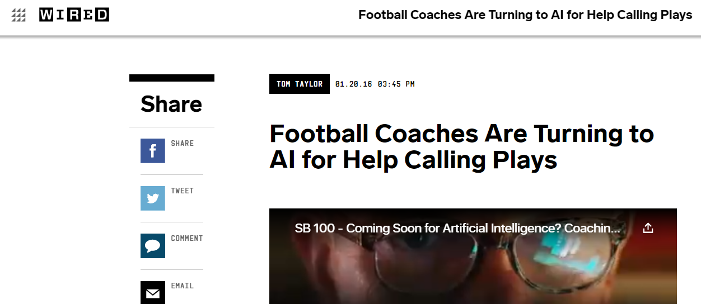

Almost 5 years past, it's about time to reflect on my experience going to Super Bowl 50 and the NFL Play Prediction model...    

Over the summer of 2015 I built a series of logistic regression models to predict NFL plays (Pass or Run) and presented my work at the Joint Statistical Meetings in Seattle at the end of that summer. The JSM presentation was very casual (though I was incredibly nervous and wearing a suit two sizes too big) ~ five minutes of introducing my work to an audience of around 30, followed by a poster presentation where people could walk around and learn a little more about the project. The next day was where things started to get a little crazy. My project was being covered across tons of news sources that essentially none of which actually talked to me directly. On the way back home, I recall sitting against the wall in the Seattle airport reading through all these news sources and getting a massive pit in my stomach. This was basically my first big "data science" project. I figured I had probably made many mistakes throughout the analysis, maybe interpreted something incorrectly, felt like the model was aggressively average, and now it was blowing up in the media! Someone is going to get ahold of the work and try to poke as many holes in it as possible.

Me at the airport:  

 
  

My phone in the airport:  
[Newsweek](https://www.newsweek.com/nfl-play-statistics-model-362242)

[Wired](https://www.wired.com/2016/01/football-coaches-are-turning-to-ai-for-help-calling-plays/)

[Science Daily](https://www.sciencedaily.com/releases/2015/08/150812103645.html)

[Phys.org](https://phys.org/news/2015-08-statistical-high-accuracy-play-calling-tendency.html)

And these were just a few.  Ok, so obviously it wasn't the front page of the Times.. but to me this was a lot to take in all at once. 

Upon landing back in Raleigh other news sources started reaching out to me.   
I was featured on ozy.com (They even hired a photographer to meet me at NCSU for a photo shoot - hence the pic below)  
[Ozy](https://www.ozy.com/the-new-and-the-next/will-burton-reading-the-minds-of-nfl-coaches/64690/)

and a local news station! (I couldn't find the video)

At this point friends were texting me saying their parents saw me on TV. This was all incredibly uncomfortable, but at the time my thought process was "You have to take advantage of these opportunities as they may never come around again..even if they are painful and cringy." It was also a great opportunity to get people excited about data science knowing it has applications in the sports industry and can lead to fun and interesting jobs. 

 

Now to Super Bowl 50. When I got back to school I mentioned the project and coverage to a professor of mine. He ended up reaching out to our department's (Industrial and Systems Engineering) PR agency which wanted to use the project to promote some of the interesting topics ISE students get to learn about. This PR team also happened to have relationships with NFL players and had been to Super Bowl media day with their clients in the past. They figured it'd be a perfect opportunity for both myself and the promotion of ISE to go to the event and have me do a few interviews about the project. Whew! Here we go.. off to San Francisco for Super Bowl 50. On top of having three hours of media day prep with the PR agency, I also had my sports minded friends mock interview me (shout out to Sammy Kohl who gave me a mock interview the day before for some final prep while I nervously paced in my San Francisco hotel room).    

I ended up interviewing with WRAL (A local Raleigh, NC news station) and doing both a sports radio show and a televised interview;
which in hindseight was pretty fun!

WRAL Interview
 <iframe width="700" height="415" src="https://www.wralsportsfan.com/who-knew-this-guy-did-/15322384/" frameborder="0" allow="accelerometer; autoplay; encrypted-media; gyroscope; picture-in-picture" allowfullscreen></iframe>

 

Adam and Joe Show on 99.9 FM The Fan
 <iframe width="700" height="415" src="https://www.wralsportsfan.com/superbowl/audio/15321063/" frameborder="0" allow="accelerometer; autoplay; encrypted-media; gyroscope; picture-in-picture" allowfullscreen></iframe>

When I wasn't doing interviews, I got to be a fan at the media day event and walk around to see all the cool things that were happening around me. 

Here are some of the highlights!

## Now to Reflect

I had a couple revalations coming out of this time in my life. 

**1. Success truly comes from a combination of hard work and luck**  
On the work front I had to spend hours and hours to get a model to respectable accuracy. And this was on top of a full time internship and an online class for NCSU. I worked my butt off -- exercising from 6am-7:30am, intern from 8am until 5pm, class from 5pm-7pm, model from 7pm to 10pm. Repeat. I maintained this schedule for about 2.5 months. It wasn't this militaristic the whole time, but this was a typical day.

On the luck side, I had many things going in my favor. 
* I picked a project that teed me up for success. Many data science projects fail because the solution is far too complex, sample isn't large enough, data isn't as clean as previously thought, the event is actually pretty random and difficult to predict, etc. Point being, the project could have failed to produce a shareable and compelling outcome. 
* I landed an internship that centered largely around data science projects. One of the major goals of my 8am-5pm internship was to build a model to predict whether a member was about to drop a contract with us; a binary prediction project which required the same type of models as the NFL project. Because of this I could spend time at work learning new methods, and then apply those same methods to the NFL project.
* At work I had a data science mentor I could bounce ideas off of and learn from. This is SO important when just getting into the field! 
* The ONLY reason I got any press at all was because I decided to respond to a random email sent out from the conference. It said something along the lines of: "If you think your project has appeal to the general public, then please send a write up of the work along with the important findings". I had finished up everything needed for the presentation, this was just add on work that I decided to go ahead and do. It took another 4-8 hours to put it all together but that write-up is what news outlets grasped onto. 
* The timing was perfect! NFL teams were just starting to hire analytics professionals. At the time only a couple of teams had analytics professionals helping with strategy. One of the places I interviewed with was the Pittsburgh Post Gazette. They wanted to talk to us because Pittsburgh had just hired a head of analytics a couple of weeks before and wanted to get a sense of some of the things he could do. 
* I had amazing co-workers and the perfect living situation that summer which contributed to great mental health throughout. Solving really difficult and marathon like problems requires (at least for me) a good balance of fun, stress relief, and people to lean on. My co-worker at Premier became a great friend and made work fun rather than draining. It's so difficult to work from 5pm-10pm if you are already worn out from your day job. I also lived with a friend of a friend who ended up becoming a great friend and support system while I lived in Charlotte.

**More Reflections to Come**

