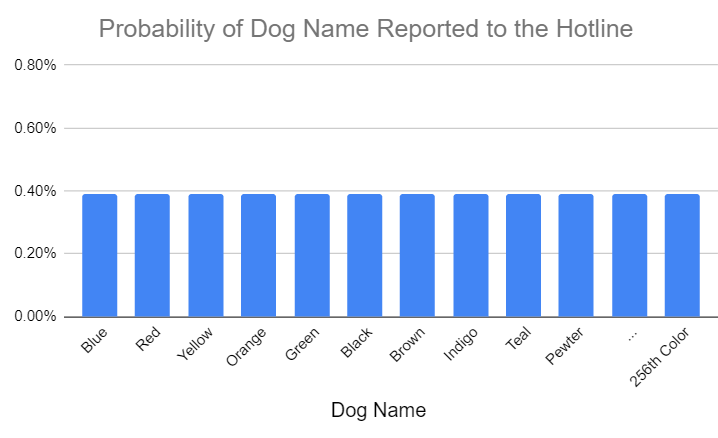
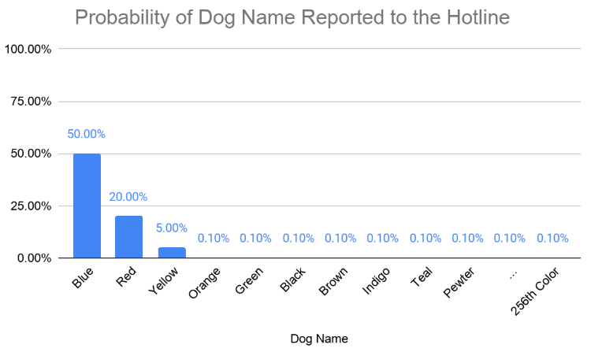
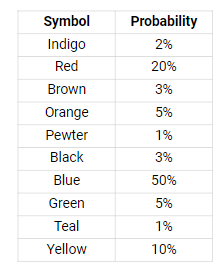
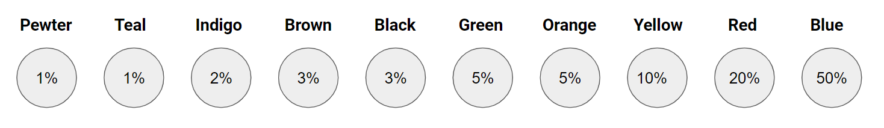
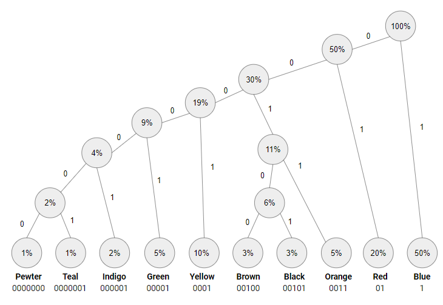
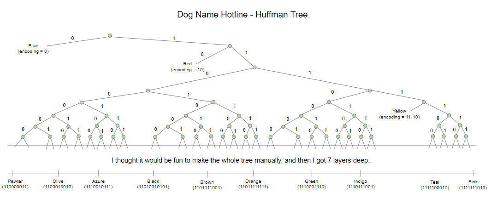

What is Information?

In the data science field, the data contains the information we use to help improve our business.
But what actually is information? How much information does our data contain? If we had a dataset that contained 10^4 columns and 10^10 rows, we would have what people call ‘Big Data’. But what if that dataset contained only 1’s. We have terabytes of data, but we actually have no information. Now let’s say you have to send this data to a friend. Would you send the entire dataset? Or just say “1”.

Claude Shannon’s Information Theory provides a way to quantitatively state how much information a stream of data has (and is primarily concerned with discrete random variables)

Information Theory was created in 1948 by Claude Shannon during his time at Bell Labs in the era of the telecommunications boom. It was important from a business perspective because Bell labs needed to know the minimum number of binary digits required to encode something to then send across a wire in the form of a voltage signal. We’re really answering the question, stripping away all the fluff, how much core information is being sent.

For example, say I wanted to send the following message:  “My dog’s name is Blue”. What is the minimum number of binary digits required to get my message across? This question is totally dependent on the possible messages that CAN be sent across the wire. If this was a “What is your dog’s name hotline”, and the only possible dog names available were colors, then the number of different codes that can be sent is equivalent to the number of colors. Rejecting ‘wall paint’ colors as possible options... let’s assume for convenience sake that there are 256 unique colors. Ah! Why did I pick 256? This is because the minimum number of binary digits you need to send all the possibilities is 8 (or is it..)

How does this encoding scheme work? Well if we used one binary digit then only two dog names could be sent (two unique messages):  
0 = My dog’s name is Blue  
1 = My dog’s name is Red   

This is not a satisfactory encoding scheme because what about all the other people that want to share their dog’s name? With 1 binary digit, 254 possible names would not be able to be sent

What if we used two binary digits to encode the message? If there were two binary digits we could send four codes (four unique messages):  
00 = My dog’s name is Blue  
01= My dogs name is Red   
10 = My dog’s name is Olive  
11 = My dog’s name is Green   
 
And the pattern continues   
 1 binary digit = 2 codes 
 2 binary digits = 4 codes 
 3 binary digits = 8 codes 
 8 binary digits = 2^8 = 256 codes 
 n binary digits = 2^n codes 
 
 On the other side of the message, the hotline just needs a lookup table and now any message can be decoded. Now everyone can share their dog's name!  
 00000000 = Blue (Color 1)  
 10000000 = Red (Color 2) 
 01000000 = Yellow (Color 3) 
 00100000 = Orange (Color 4) 
 ….. 
 111111111 = Last Color (Color 256) 

 We've done it, any message can be successfully sent and now everyone is happy, the eeennnnnddd, OH NO! This is the real world, and the hotline has gotten really popular over the last two weeks. So much so that the phone is ringing off the hook 24 hours a day. Why does everyone want to share their dog’s name, and why only colors??.. are the less important questions, what is important is that the telecommunications company is being overloaded and needs to somehow reduce the amount of data being sent across the wire to the hotline. At this point the telecom company hires Claude Shannon who starts critiquing the message encoding scheme. 

 You Fools! He says. (Unlike Claude to get this upset) Your encoding scheme uses 8 binary digits for every message, but do you know how much information each actually contains? Did you even read my paper ["A Mathematical Theory of Communication"](http://people.math.harvard.edu/~ctm/home/text/others/shannon/entropy/entropy.pdf) (The foundation of information theory)?? 

 Claude continues, for this encoding to be the minimum number of binary digits required you are assuming every dog name has an equal probability of being told to the hotline. Do you think this is a reasonable assumption? Are you telling me you think Blue is just as common as Pewter? This is what your encoding assumes: 

Anyways, your assumption is.. not correct. I had already pulled the actual distribution of names people are reporting to the hotline. Blue occurs 50% of the time! This is the actual distribution:

You are using 8 binary digits for this encoding, but on average, the amount of information you gain from learning the dog's name is much less than 8 bits. The average bits of information the hotline is receiving per message is equal to what I call Entropy which is calculated as $$ \sum p(x_{i}) log_{2}(\frac{1}{p(x_{i})}) $$ where $ p(x_{i}) $ is the probability that code $ x_{i} $ matches a certain value, and i denotes the ith message that comes across the wire. For example, if $x_{100} = $ "Blue", then $p(x_{100}) = 0.5$. Simply put, it can be thought of as the [average surprise](Information Theory, A Tutorial Introduction) of the event. For example, if Pewter were reported, we would be provided a lot of information because this event is so rare. In fact, that event would contain exactly $log_{2}(\frac{1}{.001}) = log_{2}(1000) = 9.96$ Bits of information. "Blue", on the other hand, only provides 1 bit of information $ log_{2}(\frac{1}{0.5})= log_{2}(2) = 1 $ Bit

Now back to the actual distribution. Following the entropy calculation, on average, each message sent to the hotline contains about 3.7 bits of information. Based on the source coding theorem stated in my paper, since the average amount of information per message contains 3.7 Bits, then you should be able to come up with an encoding scheme that requires, on average, close to 3.7 binary digits per message. That's a 54% reduction in data sent across the wire! (as a small tangent, a bit and a binary digit are different. A bit is a measure of information, while a binary digit is a digit that takes on the value 0 or 1. For example, encoding "Blue" as "10100101" requires you to send eight binary digits, but the message only contains one bit of information).

Given all these messages are independent, the most optimal encoding scheme we can use in this situation is called Huffman Coding. The BIG win for Huffman Coding is that it uses variable length codes, assigning the shortest codes to the most common messages. At first glance, the idea of having variable length codes seems impossible. What if Blue was coded as 1 and Pewter as 111? You wouldn't know if the incoming string 111 was for Pewter or Blue Blue Blue. In addition, how do you know when to separate codes? If all you see on the other side of a wire is 0 or 1, then the easiest way to separate out messages is to have all codes be the same length. This way if the string of binary digits came in as 110010010101, and you knew each code was four binary digits long, then you could just cut this sequence after every 4th character to correctly decode the message [1100] [1001] [0101].   

How does Huffman coding work?

***

(This example is a simplification of the original list, it uses 10 dog names) 

**1. Calculate the frequency (or probability) of each symbol**

**2. Sort the list by least to most likely**

**3. Form a Huffman Tree:**  
Steps:   
a. Join together the two least likely events with a parent node (the two least likely become the leaf nodes). The probability of making it to the parent node is the sum of the individual probabilities of the leaf nodes.  
b. Now treating the parent node as single node, repeat step a. until all of the initial nodes are connected in a single tree.

For example, with this frequency table, the two least probable names are Pewter and Teal. The first step is to join these together with a parent node. The parent node now has a 2% likelihood of being reached. Treat this new node as a new item in the list. Now the next two lowest probabilities are 2% for Indigo and 2% for the parent node of Pewter and Teal. These are joined next for a combined probability of 4%. This node joining process continues until all nodes are combined in a single tree.

Here's a short video that shows the creation of this huffman tree from start to finish (pardon the handwriting). There are two items to call out:  
1. You will notice I re-arrange the nodes here at different points in the video. This is simply to make it easier to draw the tree, there is no particular rule about this. All I'm doing is joining the two least likely events with a parent node.  
2. If there is a tie between more than 2 nodes with the lowest probabilities it doesn't matter which item is joined.

 <iframe width="560" height="315" src="https://www.youtube.com/embed/i3MjhydQNg4?start=1" frameborder="0" allow="accelerometer; autoplay; encrypted-media; gyroscope; picture-in-picture" allowfullscreen></iframe>

And the final product, a beautiful Huffman Tree!

**4. The Huffman Tree provides the encodings**  
Now that we have the tree, we know what our encodings are for each symbol. All you have to do is assign a 1 for every right branch and a 0 for every left branch. Follow the path from the top of the tree to the leaf node and you have your code. For example, assume we want to get the code for Brown. Starting at the top we have to go 'left'-'left'-'right'-'left'-'left' or 00100. 

The hotline just needs a copy of this tree and they can decode any message that comes across the wire!

How did the Huffman tree solve the two initial difficulties posed?:  

1. Where to cut each message? 
   * Because the codes occur at the leaves you know exactly where a new message starts and ends. Let's pretend the code 11010001 just came across the wire. Starting at the top of the tree we start with a 1. This goes directly to Blue, and at this point you can't go any deeper into the tree because you have reached a leaf node. Next we go back to the top of the tree and hit a 1 again; Blue. Back to the top - 01, this is Red. Back to the top 0001 - this maps to yellow. Now we are out of digits so we have decoded the message as 'Blue' 'Blue' 'Red' 'Yellow'.    
2. How not to mistake blue blue blue for pewter?  
   * This example is actually not possible to occur in a Huffman Tree. Given codes are at the leaves, it is impossible for one code to be the prefix of another code.

***
Back to the problem at hand. Applying Huffman coding to the initial dog name list results in the following tree (truncated due to space limitations). 

The encoding is complete and the telecommunications company has reduced the data passed across the wire by 54%! Previously "Blue" took 8 binary digits to send across but now it only takes 1! With this reduction in data, The hotline can receive all dog names without interference or delay. For his efforts, Claude received a set of golden juggling pins and a brand new unicycle -- he was never interested in the money, just an interesting problem.

***
**Resources:**  
Huffman Coding: https://www.youtube.com/watch?v=JsTptu56GM8  
Shannon's A Mathematical Theory of Communication: http://people.math.harvard.edu/~ctm/home/text/others/shannon/entropy/entropy.pdf  
Information Theory, A Tutorial Introduction (James V. Stone)  
Huffman Coding: http://compression.ru/download/articles/huff/huffman_1952_minimum-redundancy-codes.pdf 

