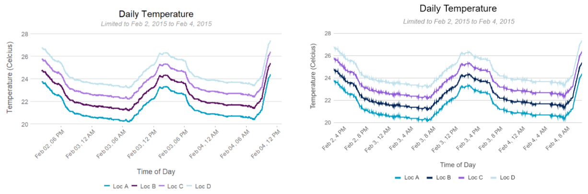

Having worked in both R and Python for multiple years at this point.. I have come to the **personal** conclusion that R is superior when it comes to data visualization and exploration. That being said, base ggplot doesn't bring visualization to the finish line. Exploration is quite fast in R, but when building a presentation, I don't feel comfortable putting a base ggplot infront of a CEO. Rather, I find myself bringing an aggregated dataframe into Google Sheets, and from there, creating a clean and customized Google chart that I then have to copy into slides. This workflow is quite inefficient.

For example, say I'm building a presentation for Cameron Clayton, the CEO of The Weather Company. Having explored the data in R, I have the following figure available to add into a presentation.


<span style="display:block;text-align:center"></span>


This plot looks like I just scrapped it together while exploring the data (Precisely)! While polished charts seem like a waste of time by the logical side of my brain, they have time and time again shown to be important in building trust with the audience (trust in both myself and my numbers). <br>

So instead, I take the time to bring the data into Google Sheets, clean it up, and paste it into Google Slides.

<span style="display:block;text-align:center"></span>

Given the inefficiency of this workflow -- there are two questions that come to mind:  
1. Are there any ggplot formats or templates that look professional?
    * Are any companies using ggplot in their public facing work? <br> 
<br>
2. How can I make my own template with my current employer's color scheme?

### Part 1.  Is there a ggplot format or template that looks professional?
> It's important to call out that professionalism is subjective. Not everyone will agree on what is professional. This section reflects my personal opinions and input from professional colleagues.

To start out I want to answer the sub-question. Are there any companies using ggplot for public display? I was able to quickly find two:
* [fivethirtyeight.com](https://fivethirtyeight.com/) | According to a [fivethirtyeight employee](https://www.reddit.com/r/statistics/comments/2jon2b/anyone_knows_how_are_made_the_graphs_on/) they do use ggplot for some graphs -- but they touch them up in illustrator. There is a fivethirtyeight ggplot theme available in the ggthemes package.
* The [BBC (British Broadcasting Corporation)](https://medium.com/bbc-visual-and-data-journalism/how-the-bbc-visual-and-data-journalism-team-works-with-graphics-in-r-ed0b35693535) | They created a package for their theme too called [bbplot](https://github.com/bbc/bbplot)!

These were the only two companies I could find without putting a ton of effort into research.. but I'm looking for companies that regularly publish charts for the general public & verify they are using ggplot.. so there might not be many instances here to find. That being said.. BBC, a news company, is publishing their ggplot charts for millions to see! 

Using the bbplot package, I re-created the initial plot shown above. 

<details><summary>Code Used</summary>
<p>

```R
library(tidyverse)
library(bbplot)

df %>%
  ggplot(aes(x = time_of_day, y = Temperature)) +
  geom_line() +
  labs(title = 'Daily Temperature',
       subtitle = 'Limited to Feb 2, 2015 to Feb 4, 2015') + 
  bbc_style() +
  theme(plot.margin = margin(10, 50, 10, 20), axis.text.x = element_text(angle = 45, hjust = 1))+
  geom_hline(yintercept = 20, size = 1, colour="#333333") +
  geom_line(colour = "#1380A1", size = 1) +
  scale_x_datetime(date_labels = "%b %d, %I %p",breaks = scales::pretty_breaks(n = 7)) + 
  ylim(NA,25)
```
</p>
</details>

<span style="display:block;text-align:center"></span>


...Which I would say is a professional looking chart (and answers the primary question)! There are a few labeling improvements for this specific chart, but that is due to the nature of the data. In many cases, at Credit Karma I am interested in clicks/impressions over time so axis titles can be redundant.


### Part 2.  How can I make my own professional template that matches a given color scheme?
Rather than explain how to create a theme, I'll point to some of the resources I found that provided an excellent walk through:
* [Building a new theme (written by Roger Peng!)](https://bookdown.org/rdpeng/RProgDA/building-a-new-theme.html)
* [Create your own theme (from scratch)](https://emanuelaf.github.io/own-ggplot-theme.html)
* [Creating Custom Color Palettes](https://drsimonj.svbtle.com/creating-corporate-colour-palettes-for-ggplot2)
* [How to Modify a Theme: Tidyverse Docs](https://ggplot2.tidyverse.org/reference/theme.html)

So with the resources listed above, I set out to create a theme that replicated the professional weather chart I would have created in Google Sheets.

Can you tell which plots were created in ggplot and which were created in google sheets?


<span style="display:block;text-align:center"></span>


What about now?


<span style="display:block;text-align:center"></span>

***

**To conclude** <br> 
It IS possible to build professional charts in ggplot, and organizations are already doing so! It just requires some time upfront to create or select and modify a theme to suit your needs. No more copying and pasting data, and as a result, a more efficient and reproducible workflow!

(Code to come)

